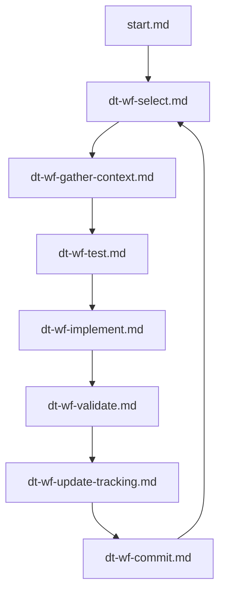

# dig-slashing — Operator Prompt



## CRITICAL: Follow the full cycle for every requirement. No shortcuts.

Every requirement MUST pass through all 7 workflow steps. Skipping any step is a blocking defect. The test step (Step 3) comes BEFORE implementation (Step 4) — this is test-driven development. Tools (Step 2) come BEFORE tests — you cannot write correct tests without understanding context.

## Workflow Cycle

| Step | File | Action | Gate |
|------|------|--------|------|
| 0 | [start.md](start.md) | Sync, check tools, pick work | Tools must be fresh |
| 1 | [dt-wf-select.md](tree/dt-wf-select.md) | Choose requirement from IMPLEMENTATION_ORDER | Must read full spec |
| 2 | [dt-wf-gather-context.md](tree/dt-wf-gather-context.md) | Pack context (Repomix), search (SocratiCode), check impact (GitNexus) | All 3 tools used |
| 3 | [dt-wf-test.md](tree/dt-wf-test.md) | **Write failing test FIRST (TDD)** | Test must fail before impl |
| 4 | [dt-wf-implement.md](tree/dt-wf-implement.md) | Implement — chia crates first, minimal own code | Tests must now pass |
| 5 | [dt-wf-validate.md](tree/dt-wf-validate.md) | Run tests, clippy, fmt, circular dep check | All checks green |
| 6 | [dt-wf-update-tracking.md](tree/dt-wf-update-tracking.md) | Update TRACKING.yaml, VERIFICATION.md, IMPLEMENTATION_ORDER.md | All 3 files updated |
| 7 | [dt-wf-commit.md](tree/dt-wf-commit.md) | Commit, push, update GitNexus index, loop | One requirement per commit |

## Decision Tree

| File | Topic |
|------|-------|
| [dt-paths.md](tree/dt-paths.md) | Path conventions |
| [dt-role.md](tree/dt-role.md) | Operator role |
| [dt-hard-rules.md](tree/dt-hard-rules.md) | Non-negotiable rules |
| [dt-authoritative-sources.md](tree/dt-authoritative-sources.md) | Spec layout and traceability |
| [dt-tools.md](tree/dt-tools.md) | GitNexus, Repomix, SocratiCode |
| [dt-git.md](tree/dt-git.md) | Git workflow |

## Tool Index

| Tool | Purpose | Docs |
|------|---------|------|
| [SocratiCode](tools/socraticode.md) | Semantic codebase search, dependency graphs | [GitHub](https://github.com/giancarloerra/socraticode) |
| [GitNexus](tools/gitnexus.md) | Knowledge graph, dependency analysis, impact checking | [npm](https://www.npmjs.com/package/gitnexus) |
| [Repomix](tools/repomix.md) | Context packing for LLM consumption | [repomix.com](https://repomix.com/) |

## Requirement Traceability

```
IMPLEMENTATION_ORDER.md  →  pick [ ] item (DSL-NNN)
        ↓
SPEC.md §22              →  read requirement statement from catalogue
        ↓
NORMATIVE.md#DSL-NNN     →  read authoritative MUST/SHOULD (if domain-split)
        ↓
specs/DSL-NNN.md         →  read detailed specification + test plan
        ↓
TOOLS: SocratiCode + Repomix + GitNexus  →  gather full context
        ↓
WRITE FAILING TEST FIRST →  tests/dsl_NNN_<name>_test.rs
        ↓
implement against spec   →  chia crates first, dig-block + dig-epoch reuse
        ↓
VERIFICATION.md          →  update status (❌ → ✅)
TRACKING.yaml            →  update status, tests, notes
IMPLEMENTATION_ORDER.md  →  check off [x]
```

## Scope Reminder

**dig-slashing is validator slashing only.** Four discrete offenses (`ProposerEquivocation`, `InvalidBlock`, `AttesterDoubleVote`, `AttesterSurroundVote`). Plus Ethereum-parity participation rewards/penalties. Plus continuous inactivity accounting. Plus an optimistic-slashing fraud-proof appeal system.

**Out of scope:** DFSP / storage-provider slashing. Different subsystem, different crate, not developed here.
